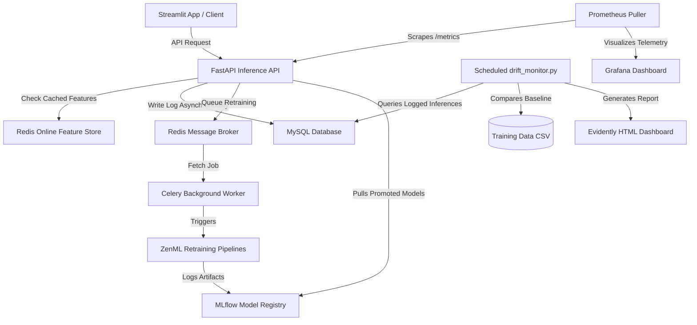

# Financial Fraud Detection MLOps Master Guide: From Notebook to Enterprise Distributed Architecture

Welcome to the comprehensive master guide for the **Financial Fraud Detection MLOps System**. This document is designed as a self-contained, beginner-friendly, and technically rigorous deep dive into the architecture, design patterns, and codebase of this project. 

If you are a software engineer, data scientist, database administrator, or hiring manager trying to understand how this system works from scratch, this document is for you. It explains not just **what** was built, but **why** it was built this way, the mathematical and operational rationales behind each decision, and how all the moving parts integrate to form a real-world, high-availability system.

---

## Table of Contents
1. [The Core Mission & The Problem Space](#1-the-core-mission--the-problem-space)
2. [The MLOps Paradigm Shift: Evolving from Jupyter Notebooks](#2-the-mlops-paradigm-shift-evolving-from-jupyter-notebooks)
3. [System Architecture: The Big Picture](#3-system-architecture-the-big-picture)
4. [Step 1: The ML Orchestration Layer (ZenML & MLflow)](#4-step-1-the-ml-orchestration-layer-zenml--mlflow)
5. [Step 2: High-Performance Serving & Online Feature Stores (FastAPI & Redis)](#5-step-2-high-performance-serving--online-feature-stores-fastapi--redis)
6. [Step 3: Decoupled Background Workers (Celery & Redis Broker)](#6-step-3-decoupled-background-workers-celery--redis-broker)
7. [Step 4: Zero-Downtime A/B Serving (Shadow Deployments)](#7-step-4-zero-downtime-ab-serving-shadow-deployments)
8. [Step 5: Observability, Telemetry & Drift Monitoring (Prometheus, Grafana, Evidently)](#8-step-5-observability-telemetry--drift-monitoring-prometheus-grafana-evidently)
9. [What is an SLA? Guarantees in Real-Time Systems](#9-what-is-an-sla-guarantees-in-real-time-systems)
10. [Hiring Manager Cheat Sheet: Why This is a Mid-to-Senior Level Portfolio Piece](#10-hiring-manager-cheat-sheet-why-this-is-a-mid-to-senior-level-portfolio-piece)

---

## 1. The Core Mission & The Problem Space

### The Financial Fraud Problem
Financial institutions process billions of transactions daily. Within these streams are fraudulent activities: credit card thefts, account takeovers, and identity scams. If a bank fails to detect fraud, it suffers direct financial losses and legal penalties. If it uses a system that is too slow or triggers too many false alarms (flagging legitimate cardholders as criminals), customers get frustrated and switch banks.

### The Objective
Build a system that receives a transaction authorization request from a credit card processor and determines whether it is fraudulent or legitimate. 

To make this practical, the system must satisfy two sets of constraints:
1. **Machine Learning Constraints:** The model must be highly accurate, catching as much fraud as possible (**High Recall**) while keeping false alarms low (**High Precision**).
2. **Software Engineering Constraints:** The system must evaluate the transaction and return a decision in under **200 milliseconds** (a latency Service Level Agreement, or SLA). If the system takes 2 seconds to respond, it slows down the checkout process, causing card processors to bypass the checks or timeout.

---

## 2. The MLOps Paradigm Shift: Evolving from Jupyter Notebooks

### The Limitations of Jupyter Notebooks
Most machine learning projects start in a Jupyter Notebook. Data scientists write code to load a dataset, clean it, train a model using `scikit-learn` or `XGBoost`, and print an accuracy score. The notebook for this project is [Financial Fruad Detection-Copy1.ipynb](file:///d:/Mlops/Financial%20Fraud%20Detection/Financial%20Fruad%20Detection-Copy1.ipynb).

While notebooks are excellent for prototyping, they are **disastrous** for production:
* **No Reproducibility:** Code cells can be run out of order. Changing a variable in cell #5 might break cell #2.
* **No Decoupling:** Preprocessing, training, and evaluation are mashed into a single file. Running a training loop requires loading the entire notebook.
* **Training-Serving Skew:** The preprocessing code used during training is copy-pasted into a script for serving. If the copy-paste is slightly wrong, or if a data type differs, the model will output incorrect predictions on live traffic.
* **State Starvation:** A notebook runs entirely in local RAM. It cannot easily scale to handle thousands of requests per second or coordinate with background databases.

### The Solution: Machine Learning Operations (MLOps)
MLOps is the practice of automating, scaling, and monitoring machine learning systems in production. It treats machine learning models as software products, introducing pipelines, automated testing, containerization, and active telemetry.

This project evolves the monolithic [Jupyter Notebook](file:///d:/Mlops/Financial%20Fraud%20Detection/Financial%20Fruad%20Detection-Copy1.ipynb) into a production-grade distributed architecture. Let's look at how the entire system is laid out.

---

## 3. System Architecture: The Big Picture

The architecture is divided into isolated components that communicate via networks and message queues. This decoupling ensures that if one part of the system is busy or offline, the core service remains functional.



### The Role of Each Component

1. **FastAPI Inference API ([inference_api.py](file:///d:/Mlops/Financial%20Fraud%20Detection/inference_api.py)):** The high-speed entry point. It receives transaction JSONs, enriches them with Redis features, runs the machine learning model, returns the fraud score, and dispatches background logs.
2. **Redis Online Feature Store:** An in-memory database. It stores real-time transaction velocities (how many times a customer has transacted in the last 1, 7, and 30 days) and serves them to FastAPI in less than 1 millisecond.
3. **MySQL Database:** The persistent database. It logs every live prediction, keeps track of ground-truth feedback, and stores logs for retraining tasks.
4. **Celery Worker ([celery_worker.py](file:///d:/Mlops/Financial%20Fraud%20Detection/celery_worker.py)):** An asynchronous background execution environment. It runs heavy training computations without consuming FastAPI's CPU.
5. **ZenML Pipelines ([run.py](file:///d:/Mlops/Financial%20Fraud%20Detection/run.py)):** The ML orchestration framework. It coordinates steps for loading data, cleaning features, training models, and selecting the best performer.
6. **MLflow Tracking & Model Registry:** The experiment database. It records hyperparameter runs, compares accuracy metrics, and serves as a registry where models are tagged as `STAGING` or `PRODUCTION`.
7. **Evidently Framework ([drift_monitor.py](file:///d:/Mlops/Financial%20Fraud%20Detection/drift_monitor.py)):** The ML observability library. It tests live inference data against baseline training data to discover statistical distribution changes (Data Drift).
8. **Prometheus & Grafana:** The infrastructure observability stack. Prometheus scrapes HTTP metrics, and Grafana plots request throughput and latency distributions.
9. **Streamlit Control Panel ([streamlit_app.py](file:///d:/Mlops/Financial%20Fraud%20Detection/streamlit_app.py)):** The operator UI. It enables manual prediction testing, ground-truth logging, shadow deployment activation, and model retraining.

---

## 4. Step 1: The ML Orchestration Layer (ZenML & MLflow)

In a professional setting, a model is trained using an **Orchestrated Pipeline**. Instead of running individual script fragments, we structure training into a series of steps managed by **ZenML**.

### Pipeline Structure
The orchestration code resides in the [pipelines/](file:///d:/Mlops/Financial%20Fraud%20Detection/pipelines/) and [steps/](file:///d:/Mlops/Financial%20Fraud%20Detection/steps/) directories. There are two pipelines:
1. **Feature Engineering Pipeline ([pipelines/fraud_feature_engineering.py](file:///d:/Mlops/Financial%20Fraud%20Detection/pipelines/fraud_feature_engineering.py)):** Loads raw transaction data and calculates behavioral velocity features.
2. **Training Pipeline ([pipelines/fraud_training.py](file:///d:/Mlops/Financial%20Fraud%20Detection/pipelines/fraud_training.py)):** Loads the engineered datasets, preprocesses them, balances the target classes, trains the specified model type, evaluates it, and promotes the model if it beats the baseline.

Let's trace how data flows through the steps:

```
[Loader Step] ──> [Feature Engineer Step] ──> [Preprocessor Step] ──> [Trainer Step] ──> [Evaluator Step] ──> [Promoter Step]
```

### The Steps in Detail

#### A. Data Loader ([steps/data_loader.py](file:///d:/Mlops/Financial%20Fraud%20Detection/steps/data_loader.py))
Loads raw transactions from the source database or local CSV files. For testing, it loads a simulation dataset called `bank_sim_data.csv` (modeled after real banking transaction profiles).

#### B. Feature Engineering ([steps/feature_engineer.py](file:///d:/Mlops/Financial%20Fraud%20Detection/steps/feature_engineer.py))
Raw transactions contain fields like `amount`, `customer_id`, `merchant_id`, and `step` (the integer day of the simulation). 
A raw transaction amount of $500 is not inherently suspicious. However, if a user who typically transacts once a day suddenly executes ten transactions in an hour, that behavior is highly suspicious.
* **The Implementation:** We convert the integer `step` column into a calendar datetime (e.g., `Jan 1 2020` + `step` days). We sort by customer and datetime. We then calculate rolling transaction counts for 1-day, 7-day, and 30-day windows.
* **Code highlight:**
  ```python
  # Count transactions by customer in the past 1 day
  temp = pd.Series(df_group.index, index=df_group.date).sort_index()
  count_1_day = temp.rolling("1d").count() - 1  # subtract 1 to exclude the current transaction
  ```
* **Security & Generalization Principle:** After engineering these counts, we explicitly drop the `customer_id`, `merchant_id`, and `date` columns. If the model trained on specific IDs, it would memorize those specific users and merchants. Dropping these identity details forces the model to learn general fraud **behavior** instead of specific customer **identities**.

#### C. Data Preprocessing & Training-Serving Skew Prevention ([steps/data_preprocessor.py](file:///d:/Mlops/Financial%20Fraud%20Detection/steps/data_preprocessor.py))
Machine learning algorithms cannot process raw text (like categories: `es_transportation`, `es_food`) and require numeric inputs. We use:
1. `OneHotEncoder` to convert categorical text columns (`category`, `gender`, `age`) into binary columns.
2. `StandardScaler` to normalize the numerical columns (`amount`, `count_1_day`, etc.) so they have a mean of 0 and a standard deviation of 1.

* **Critical Architectural Decision:** We bundle the scaler and encoder into a single physical scikit-learn `Pipeline` object and save it as a ZenML artifact named `fraud_preprocess_pipeline`. 
* **Why?** When the FastAPI inference server receives live JSON, it must apply the exact same mathematical scale factors (the same mean, standard deviation, and categories) to the live data. By loading the saved pipeline artifact, we ensure **online-offline feature consistency** and completely eliminate Training-Serving Skew.

#### D. SMOTE: Handling Class Imbalance ([steps/data_splitter.py](file:///d:/Mlops/Financial%20Fraud%20Detection/steps/data_splitter.py) & [steps/model_trainer.py](file:///d:/Mlops/Financial%20Fraud%20Detection/steps/model_trainer.py))
Fraud occurs in less than 1% of transactions. If a machine learning model simply outputs "Legitimate" for every transaction, it will be 99% accurate but completely useless.
* **The Solution:** We apply **SMOTE (Synthetic Minority Over-sampling Technique)**. SMOTE generates synthetic fraud examples by drawing lines between existing fraud data points in the feature space.
* **The Rule of SMOTE:** We apply SMOTE *only* to the training split, never to the test split. The test split must remain a reflection of real-world class distributions to ensure our evaluation metrics are accurate.

#### E. Model Training ([steps/model_trainer.py](file:///d:/Mlops/Financial%20Fraud%20Detection/steps/model_trainer.py))
The training step accepts a parameter for the algorithm type. Operators can select:
* `lr`: Logistic Regression (Fast baseline)
* `xgb`: XGBoost (Powerful gradient-boosted trees)
* `catboost`: CatBoost (Optimized for categorical columns)
* `lightgbm`: LightGBM (Lightweight gradient boosting)

The trained model is registered in **MLflow** along with its parameters.

#### F. Evaluation & Model Promotion ([steps/model_evaluator.py](file:///d:/Mlops/Financial%20Fraud%20Detection/steps/model_evaluator.py) & [steps/model_promoter.py](file:///d:/Mlops/Financial%20Fraud%20Detection/steps/model_promoter.py))
* **The Metric:** In fraud, accuracy is a misleading metric. Instead, we optimize for **Recall** (Sensitivity) – the percentage of actual fraud cases that our model caught:
  $$\text{Recall} = \frac{\text{True Positives}}{\text{True Positives} + \text{False Negatives}}$$
* **The Promotion Ceremony:** The promoter queries ZenML to get the currently active `PRODUCTION` model. It compares the recall of the newly trained model against the active one on the test dataset. The new model is promoted to the **`STAGING`** stage in MLflow *only* if its performance is superior.

---

## 5. Step 2: High-Performance Serving & Online Feature Stores (FastAPI & Redis)

Once the model is trained, it must be served as an HTTP API. In real-time transaction processing, speed is everything. 

### Why FastAPI?
FastAPI is built on ASGI (Asynchronous Server Gateway Interface). It supports asynchronous programming (`async/await`), enabling it to handle thousands of concurrent requests without locking the CPU while waiting for database queries or network lookups.

### The Online Feature Store Pattern (Redis Cache)
Our machine learning model expects 7 input features:
```json
["age", "gender", "category", "amount", "count_1_day", "count_7_days", "count_30_days"]
```
When a user buys food at a grocery store, the merchant terminal sends only the raw transaction details:
```json
{
  "customer_id": "cust_123",
  "age": "3",
  "gender": "M",
  "category": "es_food",
  "amount": 45.00
}
```
Notice that the terminal **does not know** the rolling features (`count_1_day`, `count_7_days`, `count_30_days`). 

If our API queries a standard SQL database to calculate these values on the fly:
```sql
SELECT COUNT(*) FROM transactions WHERE customer_id = 'cust_123' AND timestamp > NOW() - INTERVAL 1 DAY;
```
This SQL query scans thousands of rows, taking anywhere from **100ms to 800ms**. This violates our latency SLA.

* **The Solution:** We use **Redis** as an Online Feature Store. Redis is an in-memory key-value store. It stores data in RAM, returning records in less than a millisecond.
* **The Flow:**
  1. The API receives the raw transaction containing `customer_id`.
  2. The API sends a fast read request to Redis: `HGETALL customer:cust_123`.
  3. Redis returns the pre-cached integers: `{"count_1_day": 2, "count_7_days": 5, "count_30_days": 12}` (Taking **< 1ms**).
  4. The API combines these cached numbers with the raw transaction amount and passes the unified feature array to the model.
  5. The API schedules an asynchronous task to increment the counts in Redis: `HINCRBYFLOAT customer:cust_123 count_1_day 1` so they are up-to-date for the user's *next* purchase.

### Fail-Fast Database Design
During the FastAPI startup event (`lifespan` handler), the server creates connections to the MySQL database and the Redis cache.
* **The Design Pattern:** If the MySQL database is offline, or if the Redis cache credentials are wrong, the server does not catch the error. It allows the exception to raise, causing the FastAPI process to crash.
* **Why do this?** This is known as the **Fail-Fast** pattern. If the server starts with a broken connection, it will fail every incoming transaction. By crashing immediately on startup, container orchestrators (like Kubernetes) will detect that the container is unhealthy, refuse to route traffic to it, and alert administrators.

---

## 6. Step 3: Decoupled Background Workers (Celery & Redis Broker)

### The Problem with Long-Running Tasks on the API Thread
Training a machine learning model or executing a ZenML pipeline is a heavy, CPU-bound operation that can take several minutes. 

If an operator clicks "Retrain" on the Streamlit dashboard, and the FastAPI server runs the training script inside its own process, the server's CPU utilization spikes to 100%. The server becomes unresponsive. During those minutes, thousands of live credit card transactions will fail with `504 Gateway Timeout` errors.

### The Solution: Asynchronous Task Queues with Celery
To prevent this, we decouple the API from the retraining process using **Celery**.

```
[Streamlit UI] ──(HTTP POST)──> [FastAPI Server] 
                                       │
                         (Queues task via Redis Broker)
                                       ▼
                              [Redis Task Queue]
                                       │
                             (Pulls and executes task)
                                       ▼
                             [Celery Background Worker] ──> [ZenML Pipeline]
```

1. **The Broker:** We use Redis as a Message Broker. The broker acts as a post office, holding tasks in a queue.
2. **The FastAPI Dispatch:** When FastAPI receives a `/retrain` request, it does not run the pipeline. It constructs a task message: `{"task": "run_training_pipeline_task", "args": {"model_type": "xgb"}}` and pushes it into the Redis queue. FastAPI instantly returns a message to the UI: `{"status": "queued"}` (Taking **< 10ms**).
3. **The Celery Worker ([celery_worker.py](file:///d:/Mlops/Financial%20Fraud%20Detection/celery_worker.py)):** A completely separate python process running in the background. It watches the Redis queue. When a retraining task arrives, the Celery worker picks it up and runs the training pipeline in a subprocess. FastAPI continues serving transactions with 0% CPU interference.

---

## 7. Step 4: Zero-Downtime A/B Serving (Shadow Deployments)

Deploying a model directly to production is risky. Even if a model performs well on historical test data, it might behave unexpectedly on live production data (e.g., due to minor data processing differences or live behavior shifts).

### What is a Shadow Deployment?
A shadow deployment is a deployment strategy where a candidate model (the "Shadow" model) is loaded alongside the active production model. 

1. **Incoming Request:** The server receives a live transaction.
2. **Dual Inference:** The server runs the transaction through **both** models: the active production model and the shadow model.
3. **Serving:** The server returns only the Production model's decision to the client. The client is completely unaware of the shadow model's existence.
4. **Logging:** The server logs the predictions of both models to the MySQL database (`prediction` and `shadow_prediction`).
5. **Evaluation:** Data scientists query the database to compare the accuracy and false-positive rates of both models on real live data before making any changes to production.

```
Incoming Transaction ──> [FastAPI Server]
                             ├──> Run Production Model ──> Return Response to User
                             └──> Run Shadow Model     ──> Log silently to MySQL
```

### Zero-Downtime Hot-Swapping via Atomic Pointers
When an operator decides to promote the shadow model to production, the system must not reboot or drop connections. We achieve this using memory pointer swaps.

* **In Memory State:** Inside [inference_api.py](file:///d:/Mlops/Financial%20Fraud%20Detection/inference_api.py), the models are stored in a dictionary in FastAPI's memory state:
  ```python
  app.state.models = {
      "lr_v1": (lr_model, preprocessor),
      "xgb_v2": (xgb_model, preprocessor)
  }
  app.state.active_model_version = "lr_v1"
  ```
* **The Pointer Switch:** When `/promote-shadow` is called, the server updates the string pointer:
  ```python
  request.app.state.active_model_version = shadow_id
  ```
* **Thread Safety:** Python's Global Interpreter Lock (GIL) and reference assignments are atomic. Because this assignment takes less than a microsecond, the next incoming HTTP request immediately uses the new model version, without stopping the server.

---

## 8. Step 5: Observability, Telemetry & Drift Monitoring

A model's performance in production will inevitably degrade over time as real-world behaviors shift. We need continuous monitoring to detect this degradation before it impacts business operations.

### Prometheus & Grafana (Infrastructure Telemetry)
* **Prometheus:** Connects to the FastAPI endpoint `/metrics` every few seconds to collect system-level metrics:
  * Total number of transactions processed.
  * Number of API errors (500 Internal Server Errors).
  * Inference execution speed (latency distributions).
* **Grafana:** Connects to Prometheus and draws visual charts. If the p99 latency exceeds 200ms, the team is notified immediately.

### Evidently (ML Observability & Data Drift)
Infrastructure monitoring only checks if the server is healthy. It does not check if the **data** is healthy. If the statistical distributions of features change over time, it is known as **Data Drift**.

#### The Concept of Data Drift
Suppose the model was trained on credit card transactions where the average purchase was $25. During a hyper-inflationary period, the average purchase size rises to $150. Since the model has never seen such high transaction amounts for standard users, it might begin incorrectly flagging legitimate transactions as fraud.

#### How Drift is Detected ([drift_monitor.py](file:///d:/Mlops/Financial%20Fraud%20Detection/drift_monitor.py))
1. **Fetch Production Data:** Query the MySQL database to retrieve the last 1,000 live transaction feature inputs.
2. **Fetch Reference Data:** Load a slice of the original training data (baseline).
3. **Statistical Tests:** Pass both datasets to `Evidently`. Evidently compares each column. For numerical columns (like `amount`), it runs tests like the Kolmogorov-Smirnov test to calculate a p-value indicating whether the two distributions differ.
4. **Drift Warning:** If the distribution difference is statistically significant, it logs a warning: `🚨 DATA DRIFT DETECTED! 🚨`.

#### Accessing the Evidently Metrics UI
The HTML dashboard generation is fully implemented in [drift_monitor.py](file:///d:/Mlops/Financial%20Fraud%20Detection/drift_monitor.py) by default. When the drift monitoring script runs:
```bash
python drift_monitor.py
```
It automatically processes the metrics and writes an interactive HTML dashboard file named `drift_report.html` into your project directory. 

You can simply open this `drift_report.html` file in any web browser to view visual distribution plots, drift scores, and feature-by-feature comparisons!

---

## 9. What is an SLA? Guarantees in Real-Time Systems

### Definition
An **SLA (Service Level Agreement)** is a formal agreement defining the expected performance levels of a service. 

In MLOps, SLAs are typically defined around two metrics:
1. **Latency SLA:** The maximum time allowed for a single prediction request.
2. **Availability SLA:** The percentage of time the service must be operational (e.g., 99.99% uptime).

### The 200ms Latency SLA
For real-time payments, the industry-standard latency SLA is `< 200ms`. 
If our server takes longer:
* The customer is left waiting at the checkout screen.
* The payment gateway might timeout and auto-approve the transaction, potentially allowing a fraudster to complete a purchase.

### Design Decisions Made to Meet the SLA
Every major architectural decision in this project was made to satisfy this 200ms SLA:
* **Redis cache** is used instead of SQL databases to retrieve rolling counts, reducing feature lookup from **300ms to <1ms**.
* **Decoupled training (Celery)** ensures the API CPU is never starved by model retraining.
* **Background database logging** dispatches prediction logs asynchronously, so the API returns a response to the customer without waiting for disk writes to complete.

---

## 10. Hiring Manager Cheat Sheet: Why This is a Mid-to-Senior Level Portfolio Piece

If you are using this project for career advancement, here are the key architectural decisions to highlight in an interview:

| Interview Question / Objection | Your Answer (Based on This Project) |
| :--- | :--- |
| **"Why not calculate features in SQL during inference?"** | "Executing aggregation queries (`GROUP BY`, `COUNT`) on transactional SQL databases during a live API call is too slow. It violates the latency SLA of 200ms. I implemented a Redis online feature store to cache rolling counts, reducing feature retrieval latency to sub-millisecond times." |
| **"How do you prevent Training-Serving Skew?"** | "Instead of writing separate processing code for training and serving, my ZenML training pipeline exports the scikit-learn preprocessing pipeline (standard scalers, encoders) as a serialized physical artifact. The FastAPI server loads this exact artifact on startup, ensuring identical mathematical transformations on live inputs." |
| **"What happens if your database goes down?"** | "I implemented a Fail-Fast startup architecture. The FastAPI lifespan hook establishes connections to MySQL and Redis before listening for traffic. If either service is unavailable, the application raises an unhandled exception and exits. This prevents silent failures and signals container orchestrators to avoid routing traffic to that instance." |
| **"How do you deploy new models without risk?"** | "I built a Shadow Deployment framework. When a new model is trained and promoted to staging, FastAPI loads it into memory alongside the production model. Incoming requests run predictions on both models, returning only the production prediction to the client while logging both to MySQL. This allows us to verify candidate models on live traffic before promoting them." |
| **"How do you handle heavy training tasks?"** | "I decoupled training from the API using Celery. The `/retrain` endpoint simply publishes a job message to a Redis queue. A Celery worker running in a separate process consumes the message and executes the ZenML pipeline. This keeps the API CPU free to handle incoming predictions." |

---

*This guide provides a comprehensive overview of the system architecture. For detailed API specifications, see [INFERENCE_API_DOCUMENTATION.md](./INFERENCE_API_DOCUMENTATION.md). For detailed deployment instructions, see [README.md](./README.md).*
